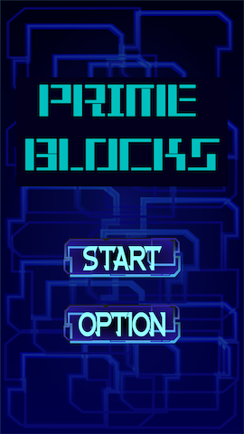
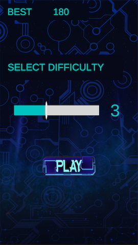
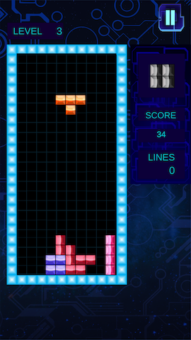

# UnityPrimeBlocks

## Ülevaade:
Tegemist on traditsioonilise tetrisega, kus kasutaja saab valida erinevate levelite vahel (0-9), mis muudab blokkide langemise kiirust. Mängus saavutatud kõrgeim skoor salvestatakse ning kuvatakse järgmisel mängimisel. 

## Juhend:
https://www.sourcecodester.com/android/11653/prime-blocks-tetris-clone-game-androidios-tutorial.html

#### Arvamus juhendist:
Juhend tundus alguses üsna põhjalik ning oli välja toodud, mida peaks Unity's seadistama, et mängu mobiilile teha. Olemas oli ka palju ekraanipilte, erinevate mänguobjektide parameetrite paika panemiseks. Puudu olid aga selgitused kasutatavate koodifailide kohta. Õnneks koodis endas kasutati üsna arusaadavaid muutujate ja funktsioonide nimesid, mis tegid toimuvast arusaamise kergeks. 

Mängu põhiosa tegema hakates selgus, et juhendis ei olnud välja toodud ega ka mainitud mängu põhi koodiosa. Selle teoreetilist olemasolu oli lihtsalt võimalik näha ühel ekraanipildil. Kuna juhendi koostajal olid kõik koodiosad failina üleval oli see võimalik sealt võtta, kuid juhendatavas tekstis peaks see kindlasti olema mainitud. Üldiselt oli valminud mäng üsna terviklik.

## SDK versiooni muutused:
Ei pidanud otseselt midagi muutma.

## Juhendi muutused:
Muutsin veidi äpi kujundust ning puutetundlikust, et oleks mugavam tetrise klotse keerata ja liigutada.